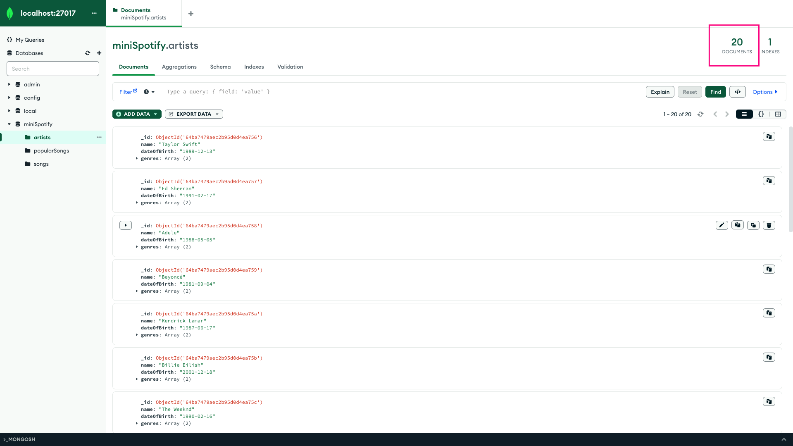
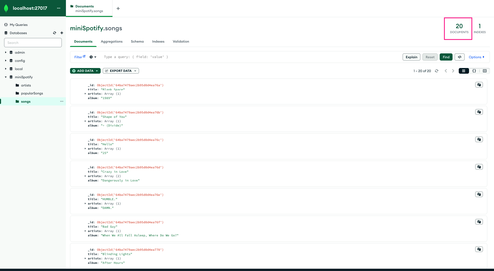
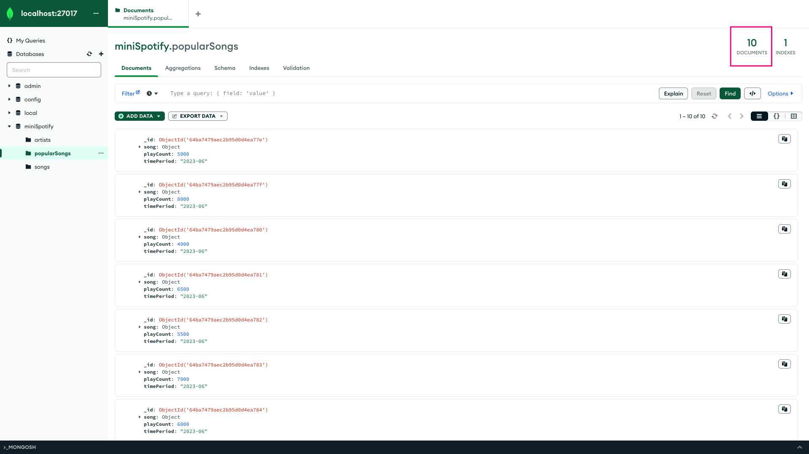

# GG Homework Module 3.1

I'm experimenting with embedded documents to dive into the world of NoSQL

## Executing a JavaScript File

Sometimes, you may have a JavaScript file containing various MongoDB commands that you want to run directly from the shell. Follow these steps to execute a JavaScript file:

1. **Open the MongoDB Shell (mongosh)**: Ensure you have MongoDB installed on your system. Open a terminal or command prompt and type `mongosh` to start the interactive shell.

2. **Load and Execute the JavaScript File**: Once you're inside the mongosh shell, use the `load()` function to load the JavaScript file and execute its contents. The syntax is as follows:

   ```javascript
   load("/path/to/your/file.js");
   ```

   Example :

   ```javascript
   load("homework_3.1.js");
   ```

## Result






